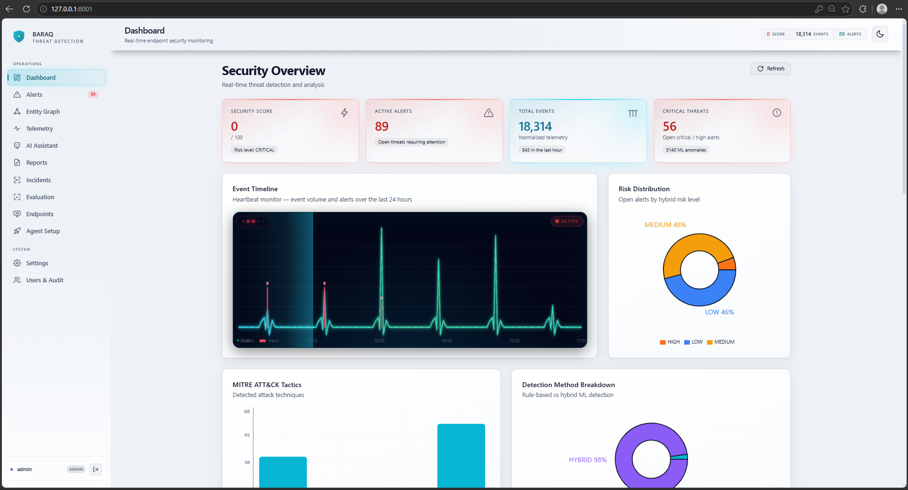
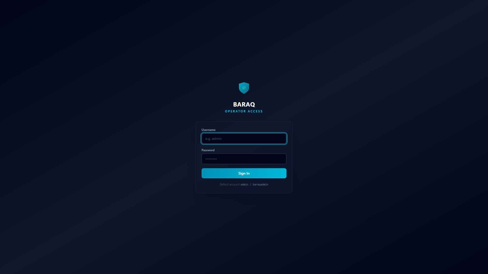

# BARAQ

[](https://github.com/natahanjr/BARAQ/actions/workflows/python-package.yml)

**BARAQ: An Intelligent Lightweight Security Operations Center Framework for Real-Time Windows Endpoint Threat Detection and Incident Analysis**

A lightweight, production-oriented SOC framework for Windows endpoints — no cloud, no heavy infrastructure. It collects real Windows telemetry, normalizes events, detects attacks with a **hybrid rule-based + machine-learning engine**, maps findings to MITRE ATT&CK, computes **hybrid risk scores**, displays everything in a professional SOC dashboard, generates executive/technical reports, and includes an **evaluation framework** that measures detection accuracy.

---

## Features

| Layer | Capabilities |
|---|---|
| **Collection** | Windows security event log (4624, 4625, 4720, 4726, 4732, 4740, 4672...), running/new processes with parent-child relationships, active TCP connections + listening ports, PowerShell operational log, **Sysmon (process tree E1 / network E3 / process access E10 / file events E11 / registry E13 / file delete E23)**, plus a realistic attack simulator |
| **Processing** | Event normalization (Event ID / Category / User / Risk / Timestamp / Host) with **numeric risk scoring (0-100)** per event |
| **Rule-Based Detection** | **100 native rules** covering all 14 MITRE ATT&CK tactic groups — Brute Force (T1110), Suspicious PowerShell (T1059.001), Privilege Escalation (T1068), Persistence (T1547), Network Reconnaissance (T1046), Lateral Movement (T1021), Data Staging (T1074), Malware File, Email Phishing, DNS/HTTP Exfiltration, USB Device, Kill-Chain Correlation (T1071), **Vulnerability Exploitation (T1190), Credential Access (T1003), Registry Run Keys (T1547.001), Scheduled Task Abuse (T1053.005), WMI Event Subscriptions (T1546.003), Account Tampering (T1098), Binary Masquerading (T1564), Artifact Hiding (T1564), LOLBins (T1218), Bulk Exfiltration (T1041), Log Clearing (T1070.001), C2 Beaconing (T1071), Ransomware Impact (T1486), Recovery Inhibition (T1490), Credential Store Theft (T1003), BITS Jobs (T1197), Shortcut Modification (T1547.009)** — each mapped to MITRE ATT&CK with confidence + remediation, plus a **Sigma engine** running the community rule set (2,512 rules, pulled via scripts/sigma_pull.py) |
| **Alert Aggregation** | Rule-level deduplication (one open alert per signature) with **repeat-trigger severity escalation** (`trigger_count`, escalating LOW→MEDIUM→HIGH→CRITICAL) |
| **ML Detection** | Per-behavior anomaly analysis (**login / process / network**) with Isolation Forest + Random Forest / XGBoost supervised classifier, **persisted model metadata and a "staleness" signal** with automatic scheduler retraining |
| **Hybrid Risk Scoring** | Alert risk = **60% rule score + 40% ML anomaly score** → 0-100 score + LOW/MEDIUM/HIGH/CRITICAL level |
| **MITRE ATT&CK** | Every alert enriched with technique ID, name, tactic, confidence and recommendation |
| **Command Center** | Live watch-over screen — security score, entity-graph stats, top-risk entities, **threat actors**, open incidents and recent alerts, refreshed every 20 s, with **AI briefing** and one-click entity analysis |
| **Dashboard** | Security score, current risk level, system status, event/alert timeline, threat categories, severity distribution, attack statistics, user behavior, detection method breakdown, top targets, live alerts |
| **Investigation** | Attack-chain reconstruction (kill chain steps), incident timeline, related events ±30 min, network context, AI explanations, **entity graph investigation (hosts / users / IPs / processes linked in a graph, Postgres or Neo4j backend)** with **threat-actor attribution** clustering hostile IOC verdicts into actor nodes |
| **Incidents & Case Management** | Group alerts into incidents, link evidence, add analyst comments, drive alerts through a **workflow state machine** (open → investigating → contained → resolved) with analyst verdicts persisted back into ML retraining |
| **Vulnerability Scanning** | Local software inventory → CVE matching engine → `vuln` findings correlated with MITRE **T1190**, exposed in the dashboard and reports |
| **Threat Intelligence** | IOC enrichment (IP / domain / hash) with **AbuseIPDB, AlienVault OTX, VirusTotal** — DB-cached, on-demand or auto-enriched from alert evidence (offline cache-first path keeps the pipeline fast), with analyst verdict overrides |
| **AI Assistant** | Local rule/TF-IDF engine — explains alerts, summarizes incidents, recommends remediation, keeps chat history, **analyzes any entity (user / device / IP / domain / file / technique)** with graph + threat-intel evidence, and **grounds answers in similar resolved incidents (RAG)** |
| **Real-Time Alerting** | Optional **webhook + SMTP notifications** on high/critical alerts plus **Windows toast alerts**; live dashboard updates via **WebSocket push** |
| **Streaming Pipeline** | Forward normalized events/alerts to external buses — **Apache Kafka, Redis Streams, Elasticsearch** (granular control of archived/alerted record models) |
| **Reporting** | Executive & technical reports exported as **PDF, HTML, JSON, CSV** |
| **Evaluation Framework** | Runs all attack scenarios + baseline in an isolated DB; computes **accuracy, precision, recall, F1-score, false-positive rate, detection time**; **hold-out evaluation** measures detection on attack scenarios the ML model never trained on with a **real-host-telemetry negative baseline**; **parameter-tuning script** grid-searches rule thresholds |
| **Security & Hardening** | Multi-user login with roles, **TOTP 2FA (MFA)**, **LDAP/AD + OIDC SSO**, DPAPI secret vault, login rate-limiting, CSRF protection, request-size guards, **tamper-evident SHA-256 audit chain**, **AES-256-GCM encryption-at-rest** (frozen builds), syslog audit stream |
| **API** | Full FastAPI REST API with OpenAPI docs at `/docs`, **API-key RBAC** (analyst/admin), and remote **agent command channel** (block_ip / kill_process / quarantine / escalate) |

---

## Dashboard

Live SOC command view: security score, current risk level, system status,
event/alert timelines, severity distribution, attack statistics, detection
method breakdown, top targets, and open alerts — refreshed in real time.





---

## Architecture

```
                ┌──────────────────────────────────────────────┐
                │              ENDPOINT AGENTS                 │
                │  eventlog │ process │ network │ PowerShell │ │
                │  Sysmon   │ USB     │ simulator            │ │
                └──────────────┬───────────────────────────────┘
                               │  HTTPS + agent key (TLS pinning)
                               ▼
                ┌──────────────────────────────────────────────┐
                │          BARAQ BACKEND (FastAPI)             │
                │  Normalizer ─► risk 0-100 ─► PostgreSQL      │
                │         │                                    │
                │         ├─► Rule-Based Detection (43 rules + Sigma)  │
                │         ├─► ML Anomaly Engine (IF/RF/XGB)    │
                │         └─► Hybrid Risk Score (60/40)        │
                │                   │                          │
                │         MITRE ATT&CK enrichment              │
                │         Alert aggregation + escalation       │
                │         Threat intel IOC enrichment          │
                └──────────────┬───────────────────────────────┘
                               │
              ┌────────────────┼──────────────────┐
              ▼                ▼                  ▼
     ┌──────────────┐  ┌──────────────┐  ┌──────────────┐
     │ SOC Dashboard│  │   Alerts /   │  │  Streaming   │
     │  (React SPA) │  │ Incidents /  │  │  Kafka/Redis │
     │  WebSocket   │  │  Audit trail │  │  /ES export  │
     └──────────────┘  └──────────────┘  └──────────────┘
```

## Detection Pipeline

1. **Collect** — agents push Windows telemetry (event log, processes, network,
   PowerShell, Sysmon) over HTTPS with agent-key auth and TLS CA pinning.
2. **Normalize** — each event is normalized to a common schema and assigned a
   numeric risk score (0-100).
3. **Detect** — a rule engine (43 built-in MITRE ATT&CK-mapped rules plus the
   full **SigmaHQ community rule set**, ~3000+ rules, when pulled) and
   per-behavior ML anomaly detection (Isolation Forest / Random Forest /
   XGBoost) evaluate the normalized stream.
4. **Score** — hybrid risk scoring blends rule and ML signals
   (60% rule / 40% ML) into a 0-100 score with LOW · MEDIUM · HIGH · CRITICAL.
5. **Enrich** — MITRE ATT&CK technique mapping, threat-intel IOC lookup
   (AbuseIPDB / OTX / VirusTotal), and entity-graph context are attached.
6. **Act** — alerts aggregate with severity escalation, notify via webhook /
   SMTP / Windows toast, stream to Kafka/Redis/Elasticsearch, and feed the
   incident workflow with AI-assisted investigation.

---

## Project Structure

```
BARAQ/
├── backend/
│   ├── ai/            # AI security assistant (local engine + RAG)
│   ├── analyzers/     # Normalizer (numeric risk) + dashboard analytics
│   ├── api/           # FastAPI routers (alerts, auth, incidents, intel, graph, realtime, ...)
│   ├── collectors/    # Windows event log, process, network, PowerShell, Sysmon, vuln scanner, simulator
│   ├── database/      # SQLAlchemy models + SQLite/PostgreSQL connection (+ additive migrations)
│   ├── detection/     # Rules engine, alert workflow, 43 detection rules
│   ├── evaluation/    # Detection evaluation framework (metrics, hold-out)
│   ├── graph/         # Entity graph (Postgres / Neo4j backend)
│   ├── mitre/         # MITRE ATT&CK techniques data + helpers
│   ├── ml/            # Isolation Forest / Random Forest / XGBoost + SHAP/LIME explanations
│   ├── reports/       # Report generator + exporters (PDF/HTML/JSON/CSV)
│   ├── risk/          # Hybrid risk scoring engine (rule 60% + ML 40%)
│   ├── streaming/      # Kafka / Redis Streams / ES forwarding
│   ├── threatintel/   # IOC enrichment (AbuseIPDB / OTX / VirusTotal)
│   └── vulnscan/      # CVE database + local inventory matching
├── frontend/          # React 18 + Tailwind CSS 4 + Recharts dashboard (login/MFA/SSO, alerts, incidents, users & audit, realtime)
├── database/          # Local database (SQLite by default, PostgreSQL for fleets)
├── logs/              # Runtime logs
├── reports/           # Generated security reports
├── scripts/           # Agent, agent.ps1, exe builder, cert generation, Postgres migration, launchers
├── tests/             # pytest test suite (623 tests)
├── tools/             # Realtime validation / SOC integration tooling
├── documentation/     # User manual, architecture, test results, evaluation report, combined guide
├── requirements.txt
└── README.md
```

---

## Requirements

- **Windows 10/11** (target: Windows 11, Intel i5, minimum 8GB RAM, any SSD)
- **Python 3.11+** (tested with 3.14)
- **Node.js 18+** (tested with 24) — only required for the dashboard
- Optional: `pywin32` for full Windows Event Log access (installed automatically on Windows)
---

## Installation

### 1. One-click launcher (recommended)

Double-click **`start.bat`** (project root). On first run it:

1. Creates the Python virtual environment and installs dependencies
2. Builds the React dashboard (if Node.js is present)
3. Generates **random admin credentials** (password + API keys) into the
   DPAPI-protected vault (`secrets.dat`) and prints them once — save them, they
   won't be shown again
4. Starts the backend and opens the browser at **http://127.0.0.1:8000**

The backend serves the built dashboard itself, so no extra configuration is
needed. To restart later, just run `start.bat` again.

### 2. Manual setup (optional)

```powershell
# from the project root
python -m venv venv
venv\Scripts\Activate.ps1
pip install -r requirements.txt
cd frontend
npm install
npm run build   # dashboard is then served by the backend
```

---

## Running the Platform

### Start the backend API

```powershell
# from the project root (with venv activated)
uvicorn backend.main:app --host 127.0.0.1 --port 8000
```

The backend starts a background scheduler (every 15 s) that collects host telemetry and runs detection automatically.

- API: `http://127.0.0.1:8000`
- Interactive API docs (Swagger): `http://127.0.0.1:8000/docs`
- Health check: `http://127.0.0.1:8000/api/health`

### Start the SOC dashboard

```powershell
cd frontend
npm run dev
```

Open **http://localhost:5173** — the dashboard auto-connects to the backend via the Vite proxy (no extra configuration). With `npm run build` (done automatically by `start.bat`), the dashboard is served directly by the backend at `http://127.0.0.1:8000` — no dev server needed.

---

## First-Run Security & Automatic Upkeep

On first start the platform **generates random credentials** and stores them in
the DPAPI-protected vault (`secrets.dat`):

- Admin dashboard password (`BARAQ_ADMIN_PASSWORD`)
- Admin + analyst API keys (`BARAQ_API_KEYS` — fully **replaces** the public dev defaults once set)
- Session-token signing secret (`BARAQ_TOKEN_SECRET`)

These are printed to the console exactly once. The dashboard shows a **setup checklist banner** until the credentials are configured and the ML model is trained.

| Automatic upkeep | Behaviour |
|---|---|
| **ML training** | Auto-trains on first start once 30+ events exist, then every ~1 h (model age) or after 200+ new events |
| **Data retention** | Purges telemetry/alerts older than `EVENT_RETENTION_DAYS` (30) every hour — the database never grows unbounded |

---
## Distributing Without Source Code

Two ways to hand the product to other people **without giving them the project files**:

### Option 0 — HTTPS deployment (STANDARD for fleet/shared use)

HTTPS is the documented way to run BARAQ for anything beyond a local
development session: it is the only transport that protects credentials and
telemetry in transit, and it is required for remote agents in a fleet.
Plain `http://` (plain `start.bat`) is for local development only.

```powershell
start.bat secure          # HTTPS on https://127.0.0.1:8443 (self-signed cert)
start.bat secure lan      # standard: HTTPS exposed to the network on 8443
```

`scripts\gen_cert.ps1` generates a self-signed certificate covering
`localhost` + all LAN IPv4 addresses (regenerated/rotated on demand by
deleting `certs\baraq.thumbprint`). When TLS is enabled the session cookie
is forced to `Secure`. To silence browser warnings, import `certs\baraq.crt`
into the *Trusted Root Certification Authorities* store of each client:

```powershell
scripts\import_cert.ps1           # current user (no admin) - most common
scripts\import_cert.ps1 -Machine  # all users (run as Administrator)
```

The login endpoint is rate-limited (5 failures per IP per
5 minutes) as brute-force protection.

**Agent transport security:** remote agents must use `https://` and should
pin the central certificate with `--tls-ca`:

```powershell
# on every fleet host - copy certs\baraq.crt from the central server
python scripts/agent.py --server https://<soc-host>:8443 --key <agent-key> --tls-ca certs\baraq.crt --interval 15
```

`scripts\provision_agent.py add <host> https://<soc-host>:8443 --tls-cert certs\baraq.crt`
writes that pin into the host config automatically. `--no-verify` exists for
isolated labs only and logs a warning on the agent.

### Option A — Run it on your machine, share the URL
Users open a browser link and log in with accounts you create — they never touch the files.

```powershell
start.bat secure lan   # HTTPS sharing (recommended)
start.bat lan          # plain HTTP (not recommended, unencrypted)
```

This opens port 8001 (or 8443 under TLS) in the firewall, prints your
machine's LAN IP, and serves the dashboard at the printed URL. Create one
account per person under **Users & Audit** (analyst role).

### Option B — Build a standalone `.exe`
Packages the whole platform (backend + dashboard + all dependencies) into a folder
they can copy to any Windows 10/11 PC — **no Python or Node needed, no source exposed**.

```powershell
scripts\build_exe.bat
# output: dist\BARAQ\BARAQ.exe (+ _internal\)
```

Recipients copy the `dist\BARAQ` folder and double-click:
```
BARAQ.exe        # local only
BARAQ.exe --lan  # accessible from the network
```
The runtime folder (database, logs, reports, `.env`) is created next to the
executable on first run.

---

## Quick Start: Generate Your First Alerts

1. Start the backend and the dashboard (above).
2. In the dashboard, open **System → Run simulation** (or use the API):

```powershell
# Full attack suite (brute force, PowerShell, privesc, persistence, port scan)
curl.exe -X POST http://127.0.0.1:8000/api/system/simulate -H "Content-Type: application/json" -d "{}"

# Single scenario
curl.exe -X POST http://127.0.0.1:8000/api/system/simulate -H "Content-Type: application/json" -d "{\"scenario\":\"brute_force\"}"
```

3. Open **Alerts** to review detections; click any alert for MITRE mapping, evidence and recommended action.
4. Open **Investigation**, select an alert, and inspect its attack chain; use **AI explanation**.
5. Open **Reports**, choose Executive/Technical + PDF/HTML/JSON/CSV and click **Generate report**.

### Collect real host telemetry

```powershell
curl.exe -X POST http://127.0.0.1:8000/api/system/collect
```

### Train and run the ML anomaly detector

```powershell
curl.exe -X POST http://127.0.0.1:8000/api/system/ml/train
curl.exe -X POST http://127.0.0.1:8000/api/system/ml/analyze
```

### Run the detection evaluation framework

```powershell
# Runs brute force, PowerShell, privesc, persistence, port scan + baseline
# through the full pipeline in an isolated temporary DB, then reports:
# accuracy, precision, recall, F1-score, false-positive rate, detection time
curl.exe -X POST http://127.0.0.1:8000/api/evaluation/run
curl.exe http://127.0.0.1:8000/api/evaluation/latest

# External-validity run: hold-out scenarios the ML model never trained on,
# with real host telemetry as the negative baseline (true negatives):
curl.exe -X POST "http://127.0.0.1:8000/api/evaluation/holdout?use_real_baseline=true"
```

### Enable Sigma community rules

The rule engine includes a SigmaHQ-compatible matcher (selections, modifiers,
boolean conditions, aggregations). Pull the community rule set (default: the
Windows rules, ~2000 files) into `sigma_rules\`, then restart BARAQ:

```powershell
python scripts\sigma_pull.py                    # windows rules (default)
python scripts\sigma_pull.py --subdirs all      # every platform (~5000)
python scripts\sigma_pull.py --dry-run          # show what would be pulled
```

Every `*.yml` under `sigma_rules\` is parsed on startup and evaluated against
the event window; `eventid`-pinned rules are prefiltered per event, and
`count() by <field>` aggregations become window-wide detections.

The same workflow is available in the dashboard under **Evaluation**.

### Deploy a central multi-university console (deployment kit)

For a fleet spread across several universities (or any set of tenants), run
one central BARAQ over HTTPS and provision hosts per campus:

1. **Install the central server**: `start.bat secure lan` (HTTPS :8443).
   Full step-by-step: [`documentation/deployment_guide.md`](documentation/deployment_guide.md).
2. **Register a campus** — `scripts/provision_university.py setup` batches
   the campus hosts, tags every host with the campus org, and writes a
   manifest (`agent_configs/<org>-manifest.json`) with one launch line per host:

```powershell
venv\Scripts\python scripts\provision_university.py setup univ-a https://soc.example.com:8443 ^
    --org-name "University A" --hosts ws-lib-01,ws-lib-02,ws-chem-04 --tls-cert certs\baraq.crt
venv\Scripts\python scripts\provision_university.py list
venv\Scripts\python scripts\provision_university.py revoke-org univ-a
```

3. **On each campus host**, run the agent with TLS pinning (restart the
   console after provisioning so keys load):

```powershell
copy \\soc-host\share\baraq.crt .\baraq.crt
python scripts\agent.py --server https://soc.example.com:8443 --key "<host-key>" --tls-ca .\baraq.crt --interval 15
```

4. **Isolation is automatic**: the campus org tags every event, alert and
   metric; campus analysts only see their own org; admins see all (and can
   switch org in the UI). Per-campus rows land in the Grafana *Fleet per Org*
   section.

```powershell
# Fleet status API
curl.exe https://<soc-host>:8443/api/endpoints -H "X-API-Key: baraq-dev-admin" -k
```

### Real-time alerting

Alerts fan out via webhook, SMTP email, and Windows toast notifications
(`TOAST_ENABLED` in `backend/config.py`; toasts use `scripts/toast.ps1`).

---

## Running Tests

```powershell
# from the project root (with venv activated)
python -m pytest tests -v
```

Result: **623 tests passed** (collectors incl. Sysmon/vuln scan, 29 detection rules + hold-out evaluation, pipeline, API + auth/RBAC, hybrid risk scoring, evaluation framework, alert aggregation/escalation/workflow verdicts, ML lifecycle + v2 generalization + async training + online learning/drift, assistant RAG, multi-endpoint ingest/fleet + agent commands, threat-intel feeds, data retention + schema migrations, entity-graph upsert integrity, encryption at rest, tamper-evident audit chain, LDAP + OIDC SSO, TOTP MFA, CSRF + request-size guards, API hardening/rate limits, observability SLOs, scheduled reports, ticketing integrations, data-quality validation + auto-repair, parameter tuning).

---

## Configuration

All tunable parameters live in `backend/config.py`:

| Setting | Default | Purpose |
|---|---|---|
| `COLLECT_INTERVAL_SECONDS` | 15 | Scheduler collection interval |
| `BRUTE_FORCE_THRESHOLD` | 5 | Failed logons within window → alert |
| `PORT_SCAN_DISTINCT_PORTS` | 20 | Distinct probed ports → alert |
| `DETECTION_WINDOW_MINUTES` | 10 | Detection correlation window |
| `ML_CONTAMINATION` | 0.05 | Isolation Forest contamination |
| `ML_RETRAIN_AFTER_MINUTES` | 1 | Model age (minutes) after which the scheduler auto-retrains (`BARAQ_ML_RETRAIN_AFTER_MINUTES`) |
| `EVENT_RETENTION_DAYS` | 30 | Telemetry/alerts older than this are auto-purged hourly |
| `ALERT_ESCALATE_AFTER` | 5 | Repeat triggers before severity escalates one level |
| `SECURITY_SCORE_PENALTY` | critical 14 / high 8 / medium 4 / low 1 | Score deduction per open alert |

Environment overrides: `BARAQ_INTERVAL`, `BARAQ_DATABASE_URL`, `BARAQ_AI_API_URL`, `BARAQ_AI_API_KEY`, `BARAQ_AI_MODEL`, `BARAQ_AUTH_ENABLED`, `BARAQ_API_KEYS`, `BARAQ_WEBHOOK_URL`, `BARAQ_SMTP_HOST`, `BARAQ_SMTP_USERNAME`, `BARAQ_SMTP_PASSWORD`, `BARAQ_SMTP_TO`, `BARAQ_TLS`, `BARAQ_TLS_CERT`, `BARAQ_TLS_KEY`, `BARAQ_ALLOW_DEV_KEYS`. The complete reference (147 flags) is in `.env.example` — regenerate it with `python scripts/gen_env_example.py`.

### Authentication & RBAC

Every `/api/*` endpoint (except health and Swagger docs) requires a valid API
key in the `X-API-Key` header. Keys map to roles — `analyst` (read + standard
operations) or `admin` (alert containment, telemetry collection, ML
retraining, evaluation):

| Setting | Default | Purpose |
|---|---|---|
| `BARAQ_AUTH_ENABLED` | `1` | Set `0` to disable auth (dev only) |
| `BARAQ_API_KEYS` | JSON map | e.g. `{"my-key":"admin"}` — fully replaces the dev defaults when set |

Dev default keys: `baraq-dev-admin` (admin) and `baraq-dev-analyst`
(analyst). The dashboard sends the admin key by default; override with the
`VITE_API_KEY` env var:
`powershell $env:VITE_API_KEY="your-key"; npm run dev`

The public dev keys are rejected in production by setting `BARAQ_ALLOW_DEV_KEYS=0`
(or by configuring `BARAQ_API_KEYS`, which fully replaces them). Sensitive
secrets (`BARAQ_ADMIN_PASSWORD`, `BARAQ_API_KEYS`, `BARAQ_TOKEN_SECRET`,
`BARAQ_AGENT_KEYS`, `BARAQ_AI_API_KEY`) are stored in a DPAPI-encrypted
`secrets.dat` vault on Windows, not in plaintext `.env`.

Inputs are validated: alert `status`/`action` and report `report_type`/`format`
are enums, pagination/limits/hours are bounded (422 on out-of-range values).

### Single sign-on (LDAP/AD and OIDC)

Local passwords are tried first; when they fail and an SSO provider is
configured, authentication falls through to the directory. Directory users are
auto-provisioned on first login (role from group membership, unusable local
password hash). `BARAQ_LDAP_ADMIN_GROUPS` controls admin role mapping for
both providers.

| Setting | Default | Purpose |
|---|---|---|
| `BARAQ_LDAP_ENABLED` | `0` | Enable LDAP/AD SSO |
| `BARAQ_LDAP_URL` | — | e.g. `ldap://dc.corp.local:389` (or `ldaps://`) |
| `BARAQ_LDAP_BIND_DN` | — | Optional service account (anonymous when empty) |
| `BARAQ_LDAP_BIND_PASSWORD` | — | Service account password (vault-stored) |
| `BARAQ_LDAP_BASE_DN` | — | Search base, e.g. `DC=corp,DC=local` |
| `BARAQ_LDAP_USER_FILTER` | `(sAMAccountName={username})` | Filter; `{username}` is substituted |
| `BARAQ_LDAP_ADMIN_GROUPS` | `Domain Admins,BARAQ Admins` | Groups that map to the admin role |
| `BARAQ_OIDC_ENABLED` | `0` | Enable OIDC SSO (e.g. Entra ID, Keycloak) |
| `BARAQ_OIDC_ISSUER` | — | Issuer discovery URL (`/.well-known/openid-configuration`) |
| `BARAQ_OIDC_CLIENT_ID` | — | OIDC client ID (vault-stored) |
| `BARAQ_OIDC_CLIENT_SECRET` | — | OIDC client secret (vault-stored) |
| `BARAQ_OIDC_SCOPES` | `openid profile email` | Scopes requested at the authorization endpoint |
| `BARAQ_OIDC_CLOCK_SKEW` | `30` | Max tolerated seconds between provider and host clocks |

OIDC uses PKCE (S256) with a nonce and signed one-time flow cookie; id_token
signatures (RS256/ES256) are verified against the provider JWKS. When OIDC is
enabled the login page shows **Continue with SSO**; the callback URL is
`{base_url}/api/auth/oidc/callback`.

---

## Security Score

- Starts at **100**; each open alert deducts points by severity (critical 14, high 8, medium 4, low 1).
- `HEALTHY` ≥ 70 · `ATTENTION` 40–69 · `CRITICAL` < 40.

## Hybrid Risk Scoring

For every alert the platform computes a **hybrid risk score (0-100)**:

```
Final Risk = 0.6 × RuleScore(severity, confidence, event count)
           + 0.4 × MLScore(mean anomaly score of evidence events)

Risk levels:  LOW (<40) · MEDIUM (40-64) · HIGH (65-84) · CRITICAL (≥85)
```

Rule-only alerts are labelled `rule`; alerts whose evidence carries ML
anomaly scores are labelled `hybrid`. Weights are configurable in
`backend/config.py` (`ML_RULE_WEIGHT`, `ML_DETECTION_WEIGHT`).

---

## Monitoring with Prometheus + Grafana

The backend exposes two Prometheus text-exposition endpoints (no extra
Python dependencies):

- `GET /api/system/metrics` — always available; authenticates with an API
  key sent either as the `X-API-Key` header or as `Authorization: Bearer
  <key>` (the latter is what Prometheus uses, since v3 removed custom
  request headers).
- `GET /metrics` — same payload, but only when `BARAQ_METRICS_PUBLIC=1`
  is set (for scrapers that cannot authenticate).

Metrics include event ingestion (by source), process/network/DNS/USB/
file-scan counters, alerts by severity/status, open alerts, incidents,
security score, rule count, ML stream readiness, collector state, uptime
and DB size. Sensitive event data is **not** exposed — only aggregate
counters.

### Docker stack (recommended)

A ready-made Prometheus + Grafana stack lives in the repo root:

```powershell
docker compose up -d
```

- Grafana: http://localhost:3000 (default `admin`/`admin`)
- Prometheus: http://localhost:9090

The stack is provisioned automatically: the Prometheus datasource and the
`baraq-overview` dashboard (security score, ingestion rates, alert
volumes, collector/ML/DB state).

Scrape authentication: Prometheus reads the API key from
`deploy/prometheus/.scrape-key` (starts as a dev default, gitignored;
replace with a real admin key). The sidecars scrape
`host.docker.internal:8001` — point `static_configs` in
`deploy/prometheus/prometheus.yml` at the backend LAN IP when the host is
bound non-loopback (`uvicorn backend.main:app --host 0.0.0.0 --port 8001`).
`GRAFANA_PORT` (from `.env` or the shell) overrides the host port when
3000 is already taken.

### Scraping without Docker

```yaml
scrape_configs:
  - job_name: baraq
    metrics_path: /api/system/metrics
    static_configs: [{ targets: ["127.0.0.1:8001"] }]
    authorization:
      type: Bearer
      credentials_file: /etc/prometheus/.scrape-key   # your API key
```

---

## Documentation

See `documentation/` for:

- `user_manual.md` — complete operator guide
- `database_schema.md` — schema, tables and ER notes
- `architecture.md` — system architecture, data flow, and ASCII diagram
- `test_results.md` — test suite results and coverage summary
- `security_evaluation_report.md` — detection metrics (accuracy/precision/recall/F1/FPR/detection time)
- `red_team_validation.md` — realistic live-attack validation incl. documented false negatives
- `performance_benchmarks.md` — throughput/latency/memory on the target laptop
- `BARAQ_Combined_Guide.md` — single consolidated operator/maintenance walkthrough

Academic: `docs/THESIS_GUIDE.md` — full thesis/research writing scaffold
(proposed titles, research questions, literature-review map, methodology
template, the measured evaluation and performance results with reproduction
commands, limitations, ethics and a chapter-by-chapter outline).

Security: see `SECURITY.md` for the coordinated-disclosure policy and
`SECURITY_AUDIT.md` for the hardening controls inventory and pen-test
readiness checklist.

---

## Verifying the Installation

After installing the packaged build, run the bundled checker to confirm every
component is healthy:

```cmd
verify_install.cmd
```

It performs a 6-point audit: service/task registration, PostgreSQL cluster
reachability, API health, admin login, secrets vault integrity, and — on MFA-
enabled setups — that the login challenge flow returns `mfa_required` as
expected. It exits non-zero with a message on the first failing check.

---

## Roadmap

HTTPS is now the standard deployment path (`start.bat secure`, agent
`--tls-ca` pinning). Remaining planned hardening: managed certificate
rotation/CA integration, secure secret management, multi-node/ha deployment,
SOC2/ISO 27001-aligned audit trails, immutable evidence storage, and a
managed-versioning/update channel. See the phased deployment plan for details.

---

## Contributors

<!-- ALL-CONTRIBUTORS-LIST:START -->
<!-- prettier-ignore-start -->
<!-- markdownlint-disable -->
- [@natahanjr](https://github.com/natahanjr) — design, architecture, security model, and maintenance
- [Claude](https://claude.ai) — AI-assisted engineering: majority of the codebase was generated and reviewed through iterative Claude collaboration
<!-- markdownlint-enable -->
<!-- prettier-ignore-end -->
<!-- ALL-CONTRIBUTORS-LIST:END -->

Contributions are welcome — see [`CONTRIBUTING.md`](CONTRIBUTING.md) for the
workflow, commit conventions, and the AI-assisted contributions policy.
