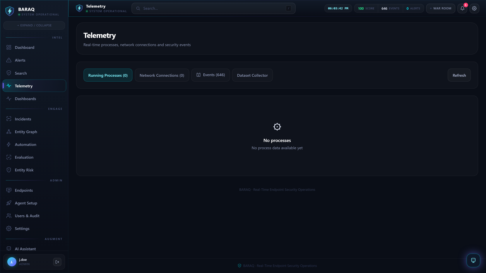
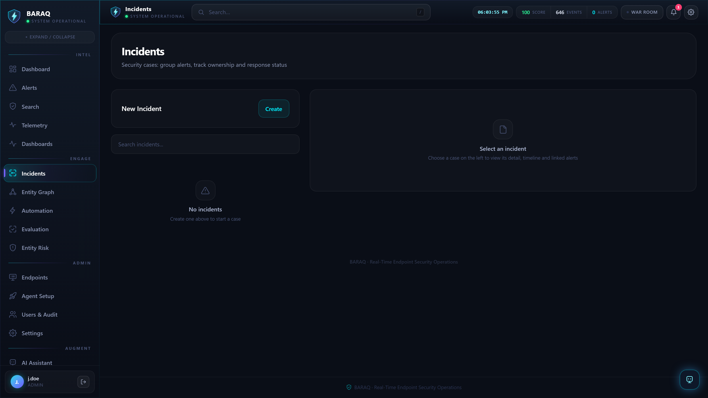
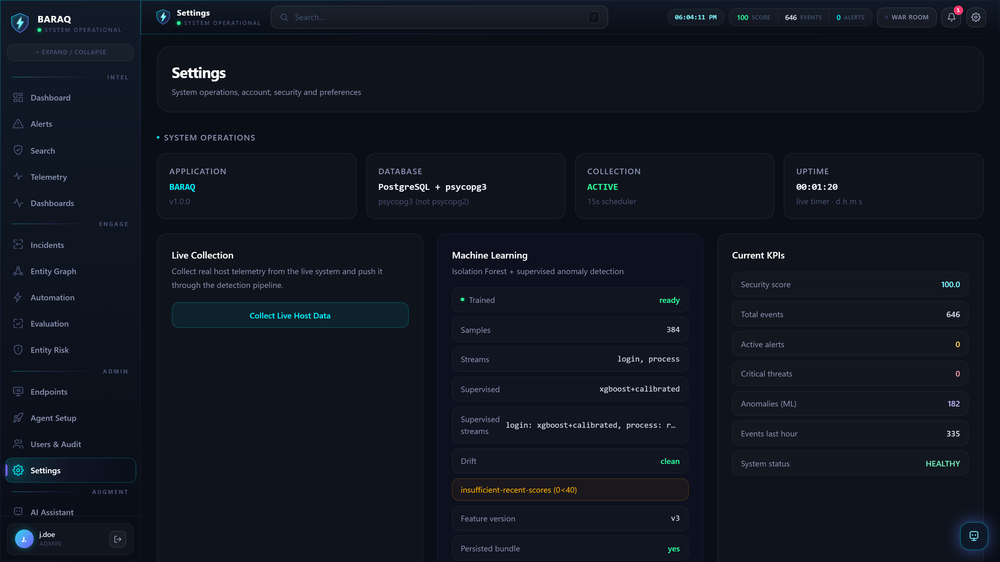

# BARAQ

### AI-Powered Security Operations Platform & Cybersecurity Research Framework

> Self-hosted Windows endpoint SOC: telemetry collection, hybrid rule + ML detection, MITRE ATT&CK mapping, investigation, SOAR automation, threat intelligence, and AI-assisted analysis — all on a single machine or scaled to agent/server fleets.

[](https://github.com/natahanjr/BARAQ/actions/workflows/python-package.yml)
[](https://www.python.org/)
[](https://fastapi.tiangolo.com/)
[](https://react.dev/)
[](https://www.postgresql.org/)
[](https://attack.mitre.org/)
[](LICENSE)

---

## At a Glance

| Capability | BARAQ |
|---|---|
| Deployment | Self-hosted (local or fleet) |
| Primary Endpoint | Windows 10/11 |
| Detection | 100 native rules + Sigma + ML + correlation chains |
| Framework | MITRE ATT&CK (14 tactic groups) |
| Investigation | Alerts + incidents + entity graph + AI analysis |
| Automation | SOAR playbooks (block, isolate, disable, escalate) |
| Intelligence | IOC enrichment (AbuseIPDB, OTX, VirusTotal + 6 more) |
| AI | Local AI-assisted alert analysis and investigation |
| Research | ML evaluation framework + attack simulation |
| API | FastAPI / OpenAPI with RBAC |
| Security | 2FA, RBAC, LDAP/OIDC SSO, encryption at rest, audit chain |

---

## Screenshots

| Login | SOC Dashboard |
|---|---|
|  |  |

| Security Alerts | Live Telemetry |
|---|---|
|  |  |

| Threat Investigation | AI Assistant |
|---|---|
|  |  |

| Incidents | Entity Graph |
|---|---|
|  |  |

| ML Evaluation | Settings |
|---|---|
|  |  |

---

## Why BARAQ?

### Detection

- **100 built-in detection rules** covering all 14 MITRE ATT&CK tactic groups — Brute Force (T1110), Suspicious PowerShell (T1059.001), Privilege Escalation (T1068), Persistence (T1547), Network Reconnaissance (T1046), Lateral Movement (T1021), Data Staging (T1074), Malware File, Email Phishing, DNS/HTTP Exfiltration, USB Device, Kill-Chain Correlation (T1071), Vulnerability Exploitation (T1190), Credential Access (T1003), Registry Run Keys (T1547.001), Scheduled Task Abuse (T1053.005), WMI Event Subscriptions (T1546.003), Account Tampering (T1098), Binary Masquerading (T1564), LOLBins (T1218), Bulk Exfiltration (T1041), Log Clearing (T1070.001), C2 Beaconing (T1071), Ransomware Impact (T1486), BITS Jobs (T1197), and more — each with confidence scores and remediation guidance.
- **2,500+ Sigma community rules** via the SigmaHQ-compatible engine (pulled with `scripts/sigma_pull.py`).
- **11 declarative YAML correlation chains** — multi-stage, multi-source joins across alert stages and raw telemetry on the same entity (initial-access → execution, persistence → credential access, discovery → lateral movement, collection → exfiltration, defense evasion → impact, download → C2 beacon).
- **Day-1 armed detection** — a bundled bootstrap ML model ensures a fresh deployment is never blind; the first local retrain supersedes it automatically.

### Investigation

- Attack-chain reconstruction with kill-chain steps, incident timeline, related events ±30 min, and network context.
- **Entity graph** — hosts, users, IPs, and processes linked in a graph (Postgres or Neo4j backend) with threat-actor attribution clustering.
- **Pipe-based search language** over events and alerts — `stats`, `top`, `rare`, `table`, `fields`, `sort`, `where`, `limit`, `timechart`, `transaction`; full reference in [`docs/search_language.md`](docs/search_language.md).
- Saved searches and custom dashboards with live panel rendering.

### Automation

- **SOAR playbooks** — trigger conditions → ordered actions (block_ip, quarantine, isolate, disable_account, escalate, create_incident, notify) that fire automatically from the detection pipeline.
- Run logs and manual test/run from the UI.

### Intelligence

- **IOC enrichment** — AbuseIPDB, AlienVault OTX, VirusTotal, ThreatFox, URLhaus, MalwareBazaar, FindIP, isbadip.com, FFraud.com — DB-cached, on-demand or auto-enriched from alert evidence.
- Analyst verdict overrides feed back into ML retraining.

### Machine Learning

- **Per-behavior anomaly analysis** — login, process, and network behaviors analyzed with Isolation Forest + Random Forest / XGBoost supervised classifier.
- **Hybrid risk scoring** — 60% rule + 40% ML anomaly = 0–100 score with LOW / MEDIUM / HIGH / CRITICAL levels.
- Persisted model metadata, staleness signal, automatic scheduler retraining, and SHAP/LIME explanations.

### Security

- Multi-user RBAC with analyst and admin roles.
- **TOTP 2FA (MFA)**, **LDAP/AD + OIDC SSO** (Entra ID, Keycloak).
- AES-256-GCM encryption at rest, DPAPI secret vault, tamper-evident SHA-256 audit chain.
- CSRF protection, request-size guards, login rate limiting.

### Research

- **Evaluation framework** — runs attack scenarios + baseline in an isolated DB; computes accuracy, precision, recall, F1-score, false-positive rate, detection time.
- **Hold-out evaluation** — measures detection on attack scenarios the ML model never trained on, with real-host-telemetry negative baseline.
- **Parameter tuning** — grid-search script for rule thresholds.
- Researchers can modify the detection/ML pipeline and evaluate their own approaches.

---

## How BARAQ Works

```
Windows Endpoint
       │
       ▼
┌─────────────────────┐
│ Telemetry Collection │  event logs, processes, network, PowerShell, Sysmon, USB, vulns
└──────────┬──────────┘
           ▼
┌─────────────────────┐
│   Normalization      │  common schema, risk score 0–100 per event
└──────────┬──────────┘
           ▼
┌─────────────────────┐
│     Detection        │
│  ├─ Native Rules     │  100 MITRE-mapped rules
│  ├─ Sigma Rules      │  2,500+ community rules
│  ├─ Correlation      │  11 multi-stage chains
│  └─ ML Anomaly       │  Isolation Forest / RF / XGBoost
└──────────┬──────────┘
           ▼
┌─────────────────────┐
│   Risk Scoring       │  60% rule + 40% ML → 0–100 + severity level
└──────────┬──────────┘
           ▼
┌─────────────────────┐
│ Enrichment           │  MITRE ATT&CK + threat intel IOC + entity graph
└──────────┬──────────┘
           ▼
┌─────────────────────┐
│ Alerts / Incidents   │  aggregation, escalation, case management
└──────────┬──────────┘
           ▼
┌─────────────────────┐
│ Investigation / SOAR │  AI analysis, attack chain, playbooks, response
└──────────┬──────────┘
           ▼
┌─────────────────────┐
│   Analyst Action     │  block, isolate, quarantine, escalate, report
└─────────────────────┘
```

---

## Quick Start

### Requirements

- **Windows 10/11** (target: Windows 11, Intel i5, minimum 8GB RAM, any SSD)
- **Python 3.11+** (tested with 3.14)
- **Node.js 18+** (tested with 24) — only for building the dashboard
- Optional: PostgreSQL (default uses SQLite; required for fleet deployments)

### One-Click Launch

```powershell
git clone https://github.com/natahanjr/BARAQ.git
cd BARAQ
.\start.bat
```

On first run, `start.bat` will:

1. Create the Python virtual environment and install dependencies
2. Build the React dashboard (if Node.js is present)
3. Ensure a PostgreSQL database exists (sets one up automatically if needed)
4. Generate a day-1 bootstrap ML model
5. Generate random admin credentials (printed once — save them)
6. Start the backend on `http://127.0.0.1:8001`
7. Open the dashboard in your browser

### Manual Setup

```powershell
python -m venv venv
venv\Scripts\Activate.ps1
pip install -r requirements.txt
cd frontend
npm install
npm run build
cd ..
uvicorn backend.main:app --host 127.0.0.1 --port 8001
```

---

## First Run

On first start the platform generates random credentials and stores them in the DPAPI-protected vault (`secrets.dat`):

- Admin dashboard password
- Admin + analyst API keys
- Session-token signing secret

These are printed to the console **exactly once**. The dashboard shows a setup checklist banner until credentials are configured and the ML model is trained.

| What | Where |
|---|---|
| Dashboard | `http://127.0.0.1:8001` |
| API docs (Swagger) | `http://127.0.0.1:8001/docs` |
| Health check | `http://127.0.0.1:8001/api/health` |
| Credentials | Console output (first run only) |
| Vault | `secrets.dat` (DPAPI-encrypted) |

| Automatic upkeep | Behaviour |
|---|---|
| ML training | Auto-trains on first start once 30+ events exist, then every ~1 h or after 200+ new events |
| Data retention | Purges telemetry/alerts older than `EVENT_RETENTION_DAYS` (30) every hour |

---

## Using BARAQ

### Security Operations

After starting BARAQ, you can:

- **Collect** Windows telemetry — event logs, processes, network connections, PowerShell, Sysmon
- **Monitor** events in real time with live dashboard updates via WebSocket
- **Detect** suspicious activity with 100+ rules, Sigma community rules, correlation chains, and ML anomaly detection
- **Investigate** alerts with attack-chain reconstruction, entity graph, and AI-assisted analysis
- **Map** every finding to MITRE ATT&CK techniques and tactics
- **Enrich** indicators with threat intelligence from 9 providers
- **Manage** incidents through a workflow state machine (open → investigating → contained → resolved)
- **Automate** response with SOAR playbooks (block IP, isolate host, kill process, quarantine file, disable account)
- **Report** in PDF, HTML, JSON, or CSV
- **Export** all collected data (15 data types) as CSV or JSON via the Data Export page

### Security Research

BARAQ provides a reproducible platform for cybersecurity experimentation:

- **Collect** real endpoint telemetry from Windows hosts
- **Generate** security datasets with the built-in attack simulator (`scripts/seed_demo.py`)
- **Evaluate** detection performance with the evaluation framework (`POST /api/evaluation/run`)
- **Measure** accuracy, precision, recall, F1-score, false-positive rate, and detection time
- **Run** hold-out evaluation on attack scenarios the ML model never trained on
- **Tune** detection thresholds with the parameter-tuning script (`scripts/tune_parameters.py`)
- **Experiment** with ML models — Isolation Forest, Random Forest, XGBoost — and compare approaches
- **Study** false positives with the context engine and verdict-driven auto-suppression
- **Develop** new detection rules and test them against the existing rule set
- **Validate** with real-host-telemetry negative baseline (`POST /api/evaluation/holdout?use_real_baseline=true`)

### Development

BARAQ is built as a modular platform. Developers can extend:

- **Collectors** — `backend/collectors/` (add new Windows event channels or non-Windows sources)
- **Detection rules** — `backend/detection/rules/` (add native rules or Sigma files)
- **ML models** — `backend/ml/` (swap or add classifiers, feature extractors)
- **API endpoints** — `backend/api/` (FastAPI routers)
- **Frontend pages** — `frontend/src/pages/` (React + Tailwind)
- **SOAR actions** — `backend/response/actions.py` (add new response capabilities)
- **Threat intelligence providers** — `backend/threatintel/` (add new IOC sources)
- **Streaming outputs** — `backend/streaming/` (Kafka, Redis Streams, Elasticsearch)

---

## Features

| Layer | Capabilities |
|---|---|
| **Collection** | Windows event logs (Security, PowerShell, and 24+ extended channels: Defender, Firewall, Task Scheduler, RDP, WMI, Code Integrity, AppLocker, Group Policy, NTLM, Kerberos, Print Service, DNS Client, Hardware, USB, BitLocker, Disk, WFP), running/new processes with parent-child relationships, active TCP connections + listening ports, Sysmon (process tree E1 / network E3 / process access E10 / file events E11 / registry E13 / file delete E23), plus a realistic attack simulator |
| **Processing** | Event normalization (Event ID / Category / User / Risk / Timestamp / Host) with numeric risk scoring (0-100) per event |
| **Rule-Based Detection** | 100 native rules covering all 14 MITRE ATT&CK tactic groups, each mapped with confidence + remediation, plus a Sigma engine running the community rule set (2,512 rules, pulled via `scripts/sigma_pull.py`) |
| **Correlation Rules** | 11 declarative YAML correlation chains — multi-stage, multi-source joins across alert stages and raw telemetry on the same entity |
| **Search** | Pipe-based search language over events and alerts — filters, free text, `stats`, `top`, `rare`, `table`, `fields`, `sort`, `where`, `limit`, `timechart`, `transaction`; relative/ISO time windows |
| **Saved Searches & Dashboards** | One-click saved hunt queries with custom panels (table / count / top-N / trend) rendered live |
| **Risk-Based Alerting** | Entity risk engine — every alert feeds user/host/IP risk scores with MITRE-weighted contributions, decay over time, HIGH/CRITICAL escalation alerts, and a live tuning UI |
| **SOAR Automation** | Playbooks (trigger conditions → ordered actions) that fire automatically from the detection pipeline, with run log and manual test/run |
| **Alert Aggregation** | Rule-level deduplication (one open alert per signature) with repeat-trigger severity escalation |
| **ML Detection** | Per-behavior anomaly analysis (login / process / network) with Isolation Forest + Random Forest / XGBoost, persisted model metadata and automatic scheduler retraining |
| **Hybrid Risk Scoring** | Alert risk = 60% rule score + 40% ML anomaly score → 0-100 score + severity level |
| **MITRE ATT&CK** | Every alert enriched with technique ID, name, tactic, confidence and recommendation |
| **Command Center** | Live watch-over screen — security score, entity-graph stats, top-risk entities, threat actors, open incidents and recent alerts, with AI briefing |
| **Dashboard** | Security score, risk level, system status, event/alert timeline, threat categories, severity distribution, attack statistics, user behavior, detection method breakdown, top targets |
| **Investigation** | Attack-chain reconstruction, incident timeline, related events, network context, AI explanations, entity graph investigation with threat-actor attribution |
| **Incidents & Case Management** | Group alerts into incidents, link evidence, add analyst comments, drive alerts through a workflow state machine with analyst verdicts |
| **Vulnerability Scanning** | Local software inventory → CVE matching engine → findings correlated with MITRE T1190 |
| **Threat Intelligence** | IOC enrichment from 9 providers — AbuseIPDB, AlienVault OTX, VirusTotal, ThreatFox, URLhaus, MalwareBazaar, FindIP, isbadip.com, FFraud.com |
| **AI Assistant** | Local rule/TF-IDF engine — explains alerts, summarizes incidents, recommends remediation, analyzes entities with graph + threat-intel evidence, and grounds answers in similar resolved incidents (RAG) |
| **Real-Time Alerting** | Webhook + SMTP notifications on high/critical alerts, Windows toast alerts, live dashboard updates via WebSocket push |
| **Streaming Pipeline** | Forward normalized events/alerts to Apache Kafka, Redis Streams, Elasticsearch |
| **Reporting** | Executive & technical reports exported as PDF, HTML, JSON, CSV |
| **Evaluation Framework** | Runs all attack scenarios + baseline in an isolated DB; computes accuracy, precision, recall, F1-score, false-positive rate, detection time; hold-out evaluation with real-host-telemetry negative baseline |
| **Data Export** | Export all 15 collected data types (events, alerts, network, processes, DNS, HTTP, emails, USB, file scans, vulnerabilities, endpoints, incidents, threat intel, entity risk, dataset events) as CSV or JSON |
| **Security & Hardening** | Multi-user RBAC, TOTP 2FA, LDAP/AD + OIDC SSO, DPAPI secret vault, AES-256-GCM encryption at rest, tamper-evident SHA-256 audit chain, CSRF protection, request-size guards, login rate limiting |
| **API** | Full FastAPI REST API with OpenAPI docs at `/docs`, API-key RBAC (analyst/admin), and remote agent command channel |

---

## Architecture

```
                ┌──────────────────────────────────────────────┐
                │              ENDPOINT AGENTS                 │
                │  eventlog │ process │ network │ PowerShell │ │
                │  Sysmon   │ USB     │ simulator            │ │
                └──────────────┬───────────────────────────────┘
                               │  HTTPS + agent key (TLS pinning)
                               ▼
                ┌──────────────────────────────────────────────┐
                │          BARAQ BACKEND (FastAPI)             │
                │  Normalizer ─► risk 0-100 ─► PostgreSQL      │
                │         │                                    │
                │         ├─► Rule-Based Detection (100 rules + Sigma) │
                │         ├─► ML Anomaly Engine (IF/RF/XGB)    │
                │         └─► Hybrid Risk Score (60/40)        │
                │                   │                          │
                │         MITRE ATT&CK enrichment              │
                │         Alert aggregation + escalation       │
                │         Threat intel IOC enrichment          │
                └──────────────┬───────────────────────────────┘
                               │
              ┌────────────────┼──────────────────┐
              ▼                ▼                  ▼
     ┌──────────────┐  ┌──────────────┐  ┌──────────────┐
     │ SOC Dashboard│  │   Alerts /   │  │  Streaming   │
     │  (React SPA) │  │ Incidents /  │  │  Kafka/Redis │
     │  WebSocket   │  │  Audit trail │  │  /ES export  │
     └──────────────┘  └──────────────┘  └──────────────┘
```

---

## Tech Stack

| Layer | Technology |
|---|---|
| Backend | Python 3.11+, FastAPI, uvicorn, SQLAlchemy |
| Frontend | React 18, Tailwind CSS 4, Recharts, WebSocket live updates |
| Database | PostgreSQL (fleet) · SQLite (local) |
| Detection | 100 native MITRE-mapped rules · SigmaHQ rule engine (2,512 rules) · 11 YAML correlation chains · Isolation Forest / Random Forest / XGBoost |
| Integration | Kafka · Redis Streams · Elasticsearch · Prometheus + Grafana · LDAP/AD · OIDC (Entra ID / Keycloak) |
| Security | RBAC · TOTP 2FA · AES-256-GCM at rest · DPAPI vault · tamper-evident SHA-256 audit chain · CSRF + rate limiting |

---

## Project Structure

```
BARAQ/
├── backend/
│   ├── ai/            # AI security assistant (local engine + RAG)
│   ├── analyzers/     # Normalizer (numeric risk) + dashboard analytics
│   ├── api/           # FastAPI routers (alerts, auth, incidents, intel, graph, realtime, search, saved, automation, rba, export, ...)
│   ├── automation/    # SOAR playbooks (triggers → actions, auto-fire from pipeline)
│   ├── collectors/    # Windows event log, process, network, PowerShell, Sysmon, vuln scanner, simulator
│   ├── database/      # SQLAlchemy models + SQLite/PostgreSQL connection (+ additive migrations)
│   ├── detection/     # Rules engine, alert workflow, 100 detection rules, Sigma engine, YAML correlation rules
│   ├── evaluation/    # Detection evaluation framework (metrics, hold-out, full-DB)
│   ├── graph/         # Entity graph (Postgres / Neo4j backend)
│   ├── mitre/         # MITRE ATT&CK techniques data + helpers
│   ├── ml/            # Isolation Forest / Random Forest / XGBoost + SHAP/LIME explanations
│   ├── reports/       # Report generator + exporters (PDF/HTML/JSON/CSV)
│   ├── response/      # SOAR action implementations (Windows-native: firewall, taskkill, etc.)
│   ├── risk/          # Hybrid risk scoring engine (rule 60% + ML 40%) + entity risk (RBA)
│   ├── search/        # Pipe-based search engine (stats/top/timechart/transaction pipes)
│   ├── streaming/     # Kafka / Redis Streams / ES forwarding
│   ├── threatintel/   # IOC enrichment (9 providers)
│   └── vulnscan/      # CVE database + local inventory matching
├── frontend/          # React 18 + Tailwind CSS 4 + Recharts dashboard
├── scripts/           # Agent, agent.ps1, exe builder, cert generation, Postgres migration, launchers, seed_demo, sigma_pull
├── tests/             # pytest test suite (1,300+ tests)
├── documentation/     # User manual, architecture, evaluation report, deployment guide
├── docs/              # Screenshots, search language reference
├── requirements.txt
└── README.md
```

---

## Installation

### 1. One-click launcher (recommended)

Double-click **`start.bat`** (project root). On first run it:

1. Creates the Python virtual environment and installs dependencies
2. Builds the React dashboard (if Node.js is present)
3. Ensures a PostgreSQL database exists
4. Generates a day-1 bootstrap ML model
5. Generates random admin credentials into the DPAPI-protected vault (`secrets.dat`) — printed once, save them
6. Starts the backend and opens the browser at `http://127.0.0.1:8001`

To restart later, just run `start.bat` again.

### 2. Manual setup

```powershell
python -m venv venv
venv\Scripts\Activate.ps1
pip install -r requirements.txt
cd frontend
npm install
npm run build
cd ..
uvicorn backend.main:app --host 127.0.0.1 --port 8001
```

---

## Running the Platform

### Start the backend API

```powershell
uvicorn backend.main:app --host 127.0.0.1 --port 8001
```

The backend starts a background scheduler (every 15 s) that collects host telemetry and runs detection automatically.

- API: `http://127.0.0.1:8001`
- Swagger docs: `http://127.0.0.1:8001/docs`
- Health check: `http://127.0.0.1:8001/api/health`

### Start the SOC dashboard (development)

```powershell
cd frontend
npm run dev
```

Open `http://localhost:5173` — the dashboard auto-connects to the backend via the Vite proxy.

---

## Your First Detection

1. **Start BARAQ** — `.\start.bat`
2. **Seed demo data** (optional, generates 20 ATT&CK attack timelines):

```powershell
python scripts\seed_demo.py
```

3. **Open Alerts** — review detections; click any alert for MITRE mapping, evidence, and recommended action.
4. **Open Investigation** — select an alert and inspect its attack chain; use AI explanation.
5. **Open Search** — try `event_id=4625 | top 10 user` or `| timechart span=1d count by user`.
6. **Open Dashboards** — the seeded SOC Overview renders live panels from saved searches.
7. **Open Automation** — review playbook runs and entity risk tuning.

### Collect real host telemetry

```powershell
curl.exe -X POST http://127.0.0.1:8001/api/system/collect
```

### Train and run the ML detector

```powershell
curl.exe -X POST http://127.0.0.1:8001/api/system/ml/train
curl.exe -X POST http://127.0.0.1:8001/api/system/ml/analyze
```

### Run the evaluation framework

```powershell
curl.exe -X POST http://127.0.0.1:8001/api/evaluation/run
curl.exe http://127.0.0.1:8001/api/evaluation/latest

# Hold-out evaluation with real host telemetry as negative baseline:
curl.exe -X POST "http://127.0.0.1:8001/api/evaluation/holdout?use_real_baseline=true"
```

---

## Secure / Network Deployment

### Local development (default)

```powershell
start.bat              # HTTP on http://127.0.0.1:8001
```

Plain HTTP is for local development only.

### HTTPS (recommended for any shared use)

```powershell
start.bat secure       # HTTPS on https://127.0.0.1:8443 (self-signed cert)
start.bat secure lan   # HTTPS exposed to the network on 8443
```

`scripts\gen_cert.ps1` generates a self-signed certificate covering localhost + all LAN IPv4 addresses. When TLS is enabled the session cookie is forced to `Secure`.

To silence browser warnings, import `certs\baraq.crt` into the Trusted Root Certification Authorities store:

```powershell
scripts\import_cert.ps1           # current user (no admin)
scripts\import_cert.ps1 -Machine  # all users (run as Administrator)
```

### Agent transport security

Remote agents must use `https://` and should pin the central certificate:

```powershell
python scripts/agent.py --server https://<soc-host>:8443 --key <agent-key> --tls-ca certs\baraq.crt --interval 15
```

### Network sharing (no source code required)

Users open a browser link and log in with accounts you create:

```powershell
start.bat secure lan   # HTTPS sharing (recommended)
start.bat lan          # plain HTTP (not recommended)
```

---

## Standalone Distribution

### Build a standalone `.exe`

Packages the whole platform (backend + dashboard + all dependencies) into a folder that can run on any Windows 10/11 PC — no Python or Node needed, no source exposed.

```powershell
scripts\build_exe.bat
# output: dist\BARAQ\BARAQ.exe (+ _internal\)
```

Recipients copy the `dist\BARAQ` folder and double-click:

```
BARAQ.exe        # local only
BARAQ.exe --lan  # accessible from the network
```

---

## Research & Evaluation

BARAQ is a platform for reproducible cybersecurity experimentation.

### Evaluation Framework

The evaluation framework runs attack scenarios and baseline telemetry through the full detection pipeline in an isolated temporary database, then reports:

- **Accuracy** / **Precision** / **Recall** / **F1-score**
- **False-positive rate**
- **Detection time**
- **Hold-out evaluation** — detection on attack scenarios the ML model never trained on
- **Real-host-telemetry negative baseline** — true negatives from live endpoint data

```powershell
# Run all scenarios
curl.exe -X POST http://127.0.0.1:8001/api/evaluation/run

# Hold-out evaluation
curl.exe -X POST "http://127.0.0.1:8001/api/evaluation/holdout?use_real_baseline=true"

# Full database evaluation
curl.exe -X POST http://127.0.0.1:8001/api/evaluation/full-db
```

### Attack Simulation

The built-in attack simulator generates realistic Windows telemetry for 20+ MITRE ATT&CK scenarios:

```powershell
python scripts\seed_demo.py                            # full demo
python scripts\seed_demo.py --scenarios brute_force,phishing --days 7
python scripts\seed_demo.py --wipe                      # reset and re-seed
```

### Sigma Community Rules

```powershell
python scripts\sigma_pull.py                    # windows rules (default, ~2000)
python scripts\sigma_pull.py --subdirs all      # every platform (~5000)
python scripts\sigma_pull.py --dry-run          # preview
```

### Parameter Tuning

```powershell
python scripts\tune_parameters.py              # grid-search rule thresholds
```

---

## Search Language

BARAQ ships a pipe-based query language over events and alerts:

```
source=sysmon event_id=4625 "failed logon" | stats count by user, host | sort -count
event_id=4625 | timechart span=1d count by user
event_id=4625 | transaction by host maxspan=5m
index=alerts severity=critical | table name, rule, host, risk_score | sort -risk_score
```

Pipes: `stats` · `top` · `rare` · `table` · `fields` · `sort` · `where` · `limit` · `timechart` · `transaction`. Time windows are relative (`-24h`, `-7d`) or ISO. Full reference: [`docs/search_language.md`](docs/search_language.md).

---

## Monitoring with Prometheus + Grafana

The backend exposes Prometheus text-exposition endpoints:

- `GET /api/system/metrics` — authenticated (API key in `Authorization: Bearer <key>`)
- `GET /metrics` — same payload, requires `BARAQ_METRICS_PUBLIC=1`

A ready-made Docker Compose stack is included:

```powershell
docker compose up -d
# Grafana: http://localhost:3000 (admin/admin)
# Prometheus: http://localhost:9090
```

---

## Configuration

All tunable parameters live in `backend/config.py`:

| Setting | Default | Purpose |
|---|---|---|
| `COLLECT_INTERVAL_SECONDS` | 15 | Scheduler collection interval |
| `BRUTE_FORCE_THRESHOLD` | 5 | Failed logons within window → alert |
| `PORT_SCAN_DISTINCT_PORTS` | 20 | Distinct probed ports → alert |
| `DETECTION_WINDOW_MINUTES` | 10 | Detection correlation window |
| `ML_CONTAMINATION` | 0.05 | Isolation Forest contamination |
| `ML_RETRAIN_AFTER_MINUTES` | 1 | Model age before auto-retrain |
| `EVENT_RETENTION_DAYS` | 30 | Telemetry/alerts auto-purge age |
| `ALERT_ESCALATE_AFTER` | 5 | Repeat triggers before severity escalates |
| `SECURITY_SCORE_PENALTY` | critical 14 / high 8 / medium 4 / low 1 | Score deduction per open alert |

Environment overrides: `BARAQ_INTERVAL`, `BARAQ_DATABASE_URL`, `BARAQ_AI_API_URL`, `BARAQ_AI_API_KEY`, `BARAQ_AI_MODEL`, `BARAQ_AUTH_ENABLED`, `BARAQ_API_KEYS`, `BARAQ_WEBHOOK_URL`, `BARAQ_SMTP_HOST`, `BARAQ_SMTP_USERNAME`, `BARAQ_SMTP_PASSWORD`, `BARAQ_SMTP_TO`, `BARAQ_TLS`, `BARAQ_TLS_CERT`, `BARAQ_TLS_KEY`, `BARAQ_ALLOW_DEV_KEYS`. The complete reference (147 flags) is in `.env.example` — regenerate with `python scripts/gen_env_example.py`.

### Authentication & RBAC

Every `/api/*` endpoint (except health and Swagger docs) requires a valid API key in the `X-API-Key` header. Keys map to roles — `analyst` (read + standard operations) or `admin` (alert containment, telemetry collection, ML retraining, evaluation).

| Setting | Default | Purpose |
|---|---|---|
| `BARAQ_AUTH_ENABLED` | `1` | Set `0` to disable auth (dev only) |
| `BARAQ_API_KEYS` | JSON map | e.g. `{"my-key":"admin"}` — fully replaces dev defaults when set |

Dev default keys: `baraq-dev-admin` (admin) and `baraq-dev-analyst` (analyst). Sensitive secrets are stored in a DPAPI-encrypted `secrets.dat` vault, not in plaintext `.env`.

### Single Sign-On (LDAP/AD and OIDC)

| Setting | Default | Purpose |
|---|---|---|
| `BARAQ_LDAP_ENABLED` | `0` | Enable LDAP/AD SSO |
| `BARAQ_LDAP_URL` | — | e.g. `ldap://dc.corp.local:389` (or `ldaps://`) |
| `BARAQ_LDAP_BASE_DN` | — | Search base, e.g. `DC=corp,DC=local` |
| `BARAQ_LDAP_ADMIN_GROUPS` | `Domain Admins,BARAQ Admins` | Groups → admin role |
| `BARAQ_OIDC_ENABLED` | `0` | Enable OIDC SSO (Entra ID, Keycloak) |
| `BARAQ_OIDC_ISSUER` | — | Issuer discovery URL |
| `BARAQ_OIDC_CLIENT_ID` | — | OIDC client ID |

OIDC uses PKCE (S256) with nonce and signed one-time flow cookie; id_token signatures (RS256/ES256) are verified against the provider JWKS.

---

## Security Score

- Starts at **100**; each open alert deducts points by severity (critical 14, high 8, medium 4, low 1).
- `HEALTHY` ≥ 70 · `ATTENTION` 40–69 · `CRITICAL` < 40.

## Hybrid Risk Scoring

```
Final Risk = 0.6 × RuleScore(severity, confidence, event count)
           + 0.4 × MLScore(mean anomaly score of evidence events)

Risk levels:  LOW (<40) · MEDIUM (40-64) · HIGH (65-84) · CRITICAL (≥85)
```

---

## Running Tests

```powershell
python -m pytest tests -v
```

**1,300+ tests** covering: collectors (Sysmon, vuln scan), 100 detection rules + Sigma engine + 11 correlation chains, pipeline, API + auth/RBAC, hybrid risk scoring, search engine (timechart, transaction), saved searches & dashboards, automation playbooks, entity risk + tuning, evaluation framework, alert aggregation/escalation/workflow verdicts, ML lifecycle + hold-out generalization + async training + drift detection, assistant RAG, multi-endpoint ingest/fleet + agent commands, threat-intel feeds, data retention + schema migrations, encryption at rest, tamper-evident audit chain, LDAP + OIDC SSO, TOTP MFA, CSRF + request-size guards, API hardening/rate limits, data-quality validation + auto-repair.

---

## Documentation

| Document | Description |
|---|---|
| `documentation/user_manual.md` | Complete operator guide |
| `documentation/architecture.md` | System architecture and data flow |
| `documentation/database_schema.md` | Schema, tables, and ER notes |
| `documentation/deployment_guide.md` | Central fleet deployment guide |
| `documentation/test_results.md` | Test suite results and coverage |
| `documentation/red_team_validation.md` | Live-attack validation |
| `documentation/performance_benchmarks.md` | Throughput, latency, memory benchmarks |
| `documentation/BARAQ_Combined_Guide.md` | Consolidated operator/maintenance walkthrough |
| `docs/search_language.md` | Search language reference |
| `SECURITY.md` | Coordinated disclosure policy |
| `CONTRIBUTING.md` | Contribution workflow and conventions |

---

## Verifying the Installation

```cmd
verify_install.cmd
```

Performs a 6-point audit: service/task registration, PostgreSQL reachability, API health, admin login, secrets vault integrity, and MFA challenge flow.

---

## Known Limitations

| Limitation | Status | Notes |
|---|---|---|
| Poll-based collection (15 s local blind spot) | Mitigated | Configurable down to 1 s; remote agents push in real time |
| Short detection windows (recon evasion) | Fixed | `PORT_SCAN_WINDOW_SECONDS` configurable (default 300 s) |
| ML trained on synthetic corpus | Mitigated | Day-1 bootstrap is synthetic by design; scheduler retrains on real telemetry; `BARAQ_ML_ALLOW_BOOTSTRAP=0` refuses synthetic model |
| Vault not enforced off-Windows | Fixed | AES-256-GCM (Fernet) on non-Windows; `BARAQ_VAULT_ENFORCED=1` fails closed |
| Multi-node / HA | Partial | Single-writer HA via distributed lock + stateless API replicas; active-active detection requires distributed rewrite |

---

## Contributors

<!-- ALL-CONTRIBUTORS-LIST:START -->
<!-- prettier-ignore-start -->
<!-- markdownlint-disable -->
- [@natahanjr](https://github.com/natahanjr) — design, architecture, security model, and maintenance
<!-- markdownlint-enable -->
<!-- prettier-ignore-end -->
<!-- ALL-CONTRIBUTORS-LIST:END -->

Contributions welcome — see [`CONTRIBUTING.md`](CONTRIBUTING.md) for workflow, commit conventions, and the AI-assisted contributions policy.

---

## License

[MIT](LICENSE)
